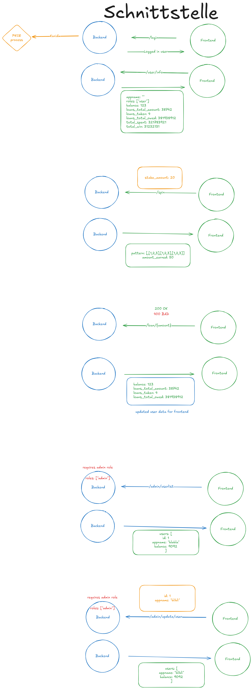

**M183 Grand Casino Rehmann**

This project is part of LB2 in the Module 183. Contributers are:

- Timeon Haas
- Nico Rehmann

# Documentation

We store and share important information about our project here in this section.

## Overview

A small "casino" web app: log in via an OIDC identity provider, play a slot
machine, take loans, and (as an admin) manage users. It demonstrates secure
authentication (OAuth2/OIDC + PKCE), server-authoritative game logic, and a
containerised local environment.

## Tech stack

| Layer    | Technology                                                                                                                                                           |
| -------- | -------------------------------------------------------------------------------------------------------------------------------------------------------------------- |
| Frontend | Vue 3 + TypeScript, Vite, Pinia, vue-router, axios                                                                                                                   |
| Backend  | Rust (edition 2024), [axum](https://github.com/tokio-rs/axum) 0.8, [sqlx](https://github.com/launchbadge/sqlx) (PostgreSQL), `axum-oidc-client` (OAuth2/OIDC + PKCE) |
| Database | PostgreSQL 17                                                                                                                                                        |
| Identity | [Kanidm](https://kanidm.com/) (OIDC provider)                                                                                                                        |
| DevOps   | Podman / Docker Compose, GitHub Actions → Docker Hub                                                                                                                 |
| Dev env  | Nix flake (`flake.nix`)                                                                                                                                              |

## Project structure

```
.
├── backend/            # Rust / axum API
│   ├── src/
│   │   ├── main.rs         # entrypoint
│   │   ├── app.rs          # server bootstrap (DB pool, migrations, layers)
│   │   ├── auth.rs         # OIDC client configuration
│   │   ├── identity.rs     # extract user + roles from the OIDC token
│   │   ├── routes/         # route table
│   │   ├── handlers/       # user / slot / admin handlers
│   │   ├── db.rs           # all SQL (sqlx runtime queries)
│   │   ├── models.rs       # request/response DTOs (the API contract)
│   │   ├── game.rs         # server-authoritative slot logic
│   │   ├── config.rs       # env-driven config (loan rules)
│   │   ├── validate.rs     # input validation (usernames)
│   │   └── error.rs        # error type → HTTP/JSON mapping
│   ├── migrations/         # SQL migrations (embedded into the binary)
│   ├── Dockerfile
│   └── .env.example        # backend configuration reference
├── frontend/           # Vue 3 SPA
│   ├── src/
│   │   ├── api/            # typed API client + mock layer + endpoints
│   │   ├── components/     # SlotMachine, LoanButton, UserStats, AppHeader
│   │   ├── views/          # Home, Play, Admin, NotFound
│   │   ├── stores/         # Pinia auth store
│   │   ├── router/         # vue-router (route guards)
│   │   └── types/          # shared DTO types (mirror the backend)
│   ├── Dockerfile          # builds the SPA, served by nginx (reverse-proxies the API)
│   ├── nginx.conf
│   └── .env.example
├── devops/             # local container stack (see devops/README.md)
│   ├── docker-compose.yml          # full stack
│   ├── docker-compose.infra.yml    # postgres + kanidm
│   ├── docker-compose.backend.yml  # backend only (Docker Hub image)
│   ├── docker-compose.frontend.yml # frontend only (Docker Hub image)
│   ├── podman-up.sh                # staged bring-up for podman
│   └── kanidm/                     # kanidm config + provisioning scripts
├── assets/             # diagrams
└── flake.nix           # Nix dev shell (rust, node, podman/docker, …)
```

## Architecture & auth flow

The browser only ever talks to a single origin (the frontend on `:8081`), which
reverse-proxies the API + auth paths to the backend, so the OIDC session cookie
works without CORS. The backend is a confidential OAuth2 client (PKCE).

```
Browser ──► Frontend (nginx, :8081) ──proxy /auth,/user,/spin,/loan,/admin──► Backend (axum, :8080)
   │                                                                              │
   └──────────── login redirect ───► Kanidm (OIDC, :8443) ◄──── token exchange ───┘
                                          │
                              PostgreSQL  ◄┘ (backend persists game state)
```

- **Login**: `/auth` → backend builds a PKCE redirect to Kanidm → user logs in →
  Kanidm redirects to `/auth/callback` → backend sets the session cookie.
- **Roles**: the backend reads the user's groups/claims from the OIDC token; the
  `casino_admins` group grants the `admin` role (re-checked on every admin call).
- **Game state** (balance, stats, loans, spins) lives in PostgreSQL, split into
  `users` / `bank_accounts` / `stats` / `loans` / `spins`. The slot outcome and
  all payouts are decided by the backend (`game.rs`), never the client.

## Prerequisites

Everything is provided by the Nix dev shell:

```sh
nix develop      # rust toolchain, node, podman + docker, openssl, …
```

(Or install manually: Rust 1.85+, Node 22+, and Podman **or** Docker with the
Compose plugin.)

## Quick start — run the whole stack locally

The container stack (PostgreSQL + Kanidm + backend + frontend) lives in
`devops/`. See [`devops/README.md`](./devops/README.md) for full details.

```sh
cd devops
cp .env.example .env          # set a strong PRIVATE_COOKIE_KEY

# Podman (rootless – builds images, staged bring-up handles init containers):
./podman-up.sh
# …or Docker:
docker compose up -d --build
```

Then open <http://localhost:8081>. Kanidm runs at <https://localhost:8443>
(accept the self-signed dev certificate once). Ready-to-use demo logins are
written to `devops/kanidm/secrets/demo-credentials.txt`
(`rehmann_admin` = admin, `rehmann_user` = user).

> New accounts are created administratively in Kanidm (e.g.
> `kanidm person create <name> ...`) — Kanidm has no public self-registration.

## Local development (without rebuilding images)

Run the infrastructure in containers, the apps natively for fast iteration:

```sh
cd devops && ./podman-up.sh docker-compose.infra.yml   # postgres + kanidm only
```

**Backend** (reads `backend/.env`; copy from `backend/.env.example`):

```sh
cd backend
cargo run            # applies migrations on startup, serves on :8080
cargo test           # unit tests (slot logic, validation)
```

**Frontend** (npm manages the JS dependencies):

```sh
cd frontend
npm ci
npm run dev          # Vite dev server
npm run type-check   # vue-tsc
```

> For UI work without any backend, set `VITE_USE_MOCK=true` in `frontend/.env`
> to use the built-in mock data layer.

## Configuration

- **Backend** — `backend/.env.example` documents every variable: database URL,
  OIDC endpoints/secrets, session/cookie settings, and the **loan rules**
  (`LOAN_MAX_PER_WINDOW`, `LOAN_WINDOW_SECONDS`, `LOAN_MAX_AMOUNT`).
- **Frontend** — `frontend/.env.example`: API base URL, OIDC login/logout paths,
  and the `VITE_USE_MOCK` flag.
- **Stack** — `devops/.env.example`: Postgres credentials, Kanidm origin, and
  the cookie key shared with the backend. Images are built locally by default
  (no Docker Hub account needed); set `BACKEND_IMAGE`/`FRONTEND_IMAGE` to pull
  the published images instead.

## Continuous integration

`.github/workflows/` builds and pushes the backend and frontend Docker images to
Docker Hub on pushes to `main` that touch the respective directory.

## Interfaces


